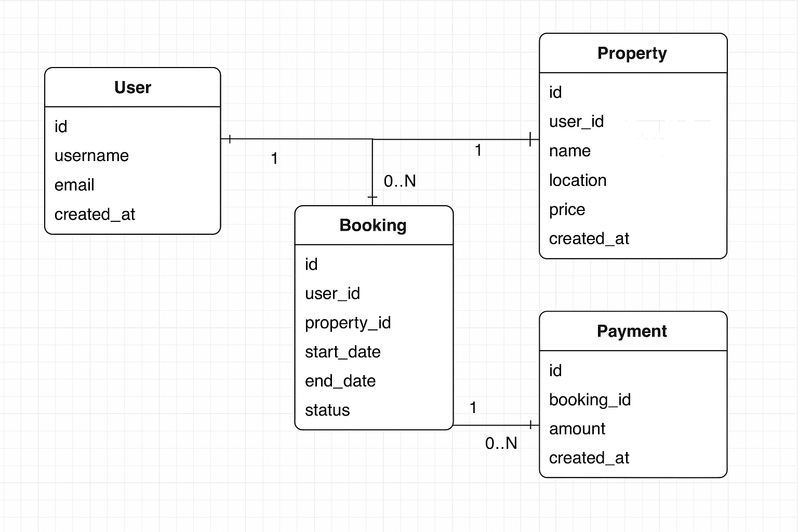

# 📘 Entity-Relationship Diagram – Airbnb Clone Database

## 🔍 Objective

As part of the ALX Backend Database module, I designed an Entity-Relationship Diagram (ERD) to represent the structure of a relational database for an Airbnb-like booking system. The goal of this task is to visualize the entities involved in the system, their attributes, and how they relate to one another in preparation for normalization, schema creation, and data seeding.

---

## 🧱 Entities and Attributes

I identified the following core entities and their key attributes:

### 1. **User**
- `id` – Primary Key
- `username`
- `email`
- `created_at`

### 2. **Property**
- `id` – Primary Key
- `user_id` – Foreign Key referencing `User(id)`
- `name`
- `location`
- `price`
- `created_at`

### 3. **Booking**
- `id` – Primary Key
- `user_id` – Foreign Key referencing `User(id)`
- `property_id` – Foreign Key referencing `Property(id)`
- `start_date`
- `end_date`
- `status`

### 4. **Payment**
- `id` – Primary Key
- `booking_id` – Foreign Key referencing `Booking(id)`
- `amount`
- `created_at`

---

## 🔗 Relationships

- A **User** can list multiple **Properties** (1:N)
- A **User** can make multiple **Bookings** (1:N)
- A **Property** can be booked multiple times (1:N with Booking)
- A **Booking** can have only one **Payment**, but a payment belongs to only one booking (1:1)

This ERD ensures that foreign keys and cardinalities are clearly defined and will guide further tasks such as normalization and schema development.

---

## 🛠 Tool Used

I used [Draw.io](https://draw.io) to design the ERD. The diagram illustrates the four main entities, their attributes, and the relationships between them.

---

## 📎 ERD Diagram

Below is the visual ERD I created for this project:

---

## ✅ Checklist

- [x] Identified all key entities
- [x] Defined attributes for each entity
- [x] Mapped out relationships and cardinalities
- [x] Created and exported ERD using Draw.io
- [x] Included image and explanation in this file

---

> *This ERD serves as the foundation for database normalization, schema scripting, and data seeding in subsequent tasks.*

