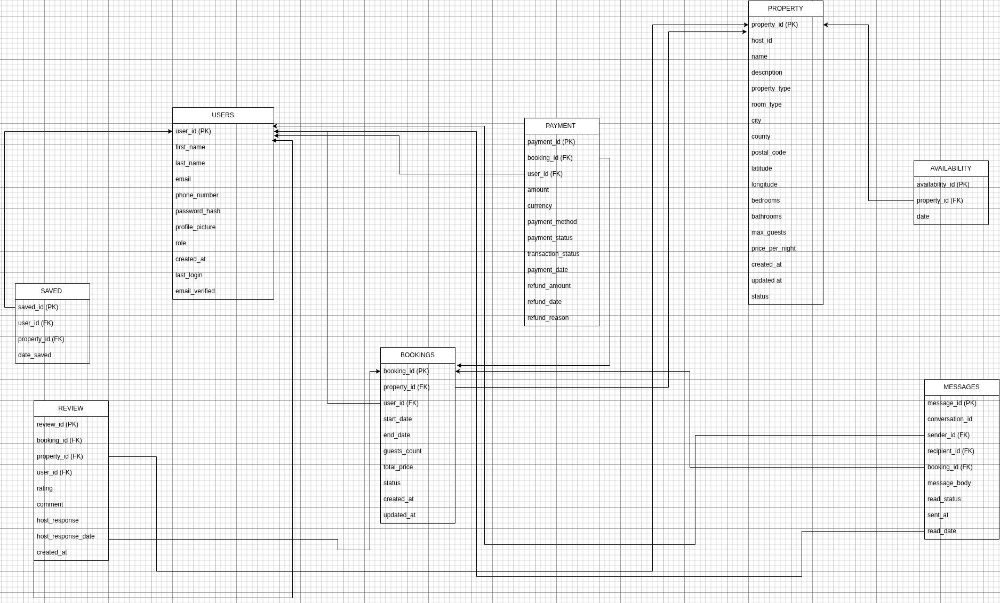

# 🏡 ALX Airbnb Database Schema

This project defines the database schema for an Airbnb-style accommodation booking platform. It outlines all core entities, their attributes, and the relationships between them. The schema supports essential functionalities such as user management, property listings, bookings, payments, messaging, reviews, and more.

---

## 📊 Entity Relationship Diagram (ERD)

---

## 🧱 Entities & Their Attributes

### 1. **USERS**
Stores information about all users, including guests and hosts.

| Attribute        | Description                        |
|------------------|------------------------------------|
| user_id (PK)     | Unique identifier                  |
| first_name       | User's first name                  |
| last_name        | User's last name                   |
| email            | Unique email address               |
| password_hash    | Hashed password                    |
| phone_number     | Contact number                     |
| profile_picture  | URL to profile image               |
| role             | guest, host, or admin              |
| created_at       | Timestamp when account was created |
| last_login       | Last login time                    |
| email_verified   | Boolean flag for email verification|

---

### 2. **PROPERTY**
Details of properties listed by hosts.

| Attribute         | Description                      |
|-------------------|----------------------------------|
| property_id (PK)  | Unique identifier                |
| host_id (FK)      | References USERS.user_id         |
| name              | Property title                   |
| description       | Detailed description             |
| property_type     | Apartment, house, etc.           |
| room_type         | Entire place, private, shared    |
| city              | City of the property             |
| county            | County/region                    |
| postal_code       | Zip/postal code                  |
| latitude          | For Mapbox geolocation           |
| longitude         | For Mapbox geolocation           |
| bedrooms          | Number of bedrooms               |
| bathrooms         | Number of bathrooms              |
| max_guests        | Maximum guest capacity           |
| price_per_night   | Cost per night                   |
| created_at        | Listing creation date            |
| updated_at        | Last updated                     |
| status            | active/inactive/suspended        |

---

### 3. **BOOKINGS**
Tracks reservations made by users for properties.

| Attribute         | Description                    |
|-------------------|--------------------------------|
| booking_id (PK)   | Unique identifier              |
| property_id (FK)  | References PROPERTY.property_id|
| user_id (FK)      | References USERS.user_id       |
| start_date        | Booking start date             |
| end_date          | Booking end date               |
| guests_count      | Number of guests               |
| total_price       | Total cost                     |
| status            | active/cancelled/completed     |
| created_at        | When booking was made          |
| updated_at        | Last status update             |

---

### 4. **PAYMENT**
Handles payment and refund records.

| Attribute           | Description                       |
|---------------------|-----------------------------------|
| payment_id (PK)     | Unique ID                         |
| booking_id (FK)     | References BOOKINGS.booking_id    |
| user_id (FK)        | References USERS.user_id          |
| amount              | Amount paid                       |
| currency            | Currency type (e.g., KES, USD)    |
| payment_method      | Mpesa, card, etc.                 |
| payment_status      | Success, failed, pending          |
| transaction_status  | Completed, reversed               |
| payment_date        | Timestamp of payment              |
| refund_amount       | Refunded amount if applicable     |
| refund_date         | Date of refund                    |
| refund_reason       | Reason for refund                 |

---

### 5. **REVIEW**
Stores user feedback on properties after booking.

| Attribute           | Description                          |
|---------------------|--------------------------------------|
| review_id (PK)      | Unique review ID                     |
| booking_id (FK)     | References BOOKINGS.booking_id       |
| property_id (FK)    | References PROPERTY.property_id      |
| user_id (FK)        | Reviewer (USERS.user_id)             |
| rating              | Numerical rating                     |
| comment             | Text feedback                        |
| host_response       | Host’s reply                         |
| host_response_date  | Reply date                           |
| created_at          | Review submission date               |

---

### 6. **AVAILABILITY**
Indicates when a property is available for booking.

| Attribute             | Description                         |
|-----------------------|-------------------------------------|
| availability_id (PK)  | Unique ID                           |
| property_id (FK)      | References PROPERTY.property_id     |
| date                  | Available date                      |

---

### 7. **SAVED**
Tracks properties that users have saved or liked.

| Attribute           | Description                         |
|---------------------|-------------------------------------|
| saved_id (PK)       | Unique ID                           |
| user_id (FK)        | References USERS.user_id            |
| property_id (FK)    | References PROPERTY.property_id     |
| date_saved          | Timestamp of save                   |

---

### 8. **MESSAGES**
Handles user-to-user conversations, especially around bookings.

| Attribute          | Description                          |
|--------------------|--------------------------------------|
| message_id (PK)    | Unique ID                            |
| conversation_id    | Chat thread identifier               |
| sender_id (FK)     | References USERS.user_id             |
| recipient_id (FK)  | References USERS.user_id             |
| booking_id (FK)    | References BOOKINGS.booking_id       |
| message_body       | Text message                         |
| read_status        | Boolean if read                      |
| sent_at            | Sent timestamp                       |
| read_date          | When message was read                |

---

## 🔗 Relationships Between Entities

- **User ↔ Booking**: One user can make many bookings.
- **User ↔ Property**: A user (host) can own many properties.
- **User ↔ Payment**: Each payment is tied to a user.
- **User ↔ Review**: A user can leave reviews for properties.
- **User ↔ Messages**: Users can send and receive many messages.
- **User ↔ Saved**: Users can save many properties.
- **Property ↔ Booking**: A property can have many bookings.
- **Property ↔ Availability**: A property has multiple availability dates.
- **Property ↔ Review**: A property can have many reviews.
- **Booking ↔ Payment**: A booking can have one payment.
- **Booking ↔ Review**: A review is tied to one booking.
- **Booking ↔ Messages**: Messages can be linked to specific bookings.

---

## 💡 Notes

- **Map Support**: Properties have `latitude` and `longitude` for integration with mapping tools like Mapbox.
- **Role Management**: Users have a `role` field (guest, host, admin) to enable permission management.
- **Refined UX**: Messaging, reviews, and saved properties are included to enhance user interaction.

---

> *This ERD serves as the foundation for database normalization, schema scripting, and data seeding in subsequent tasks.*

